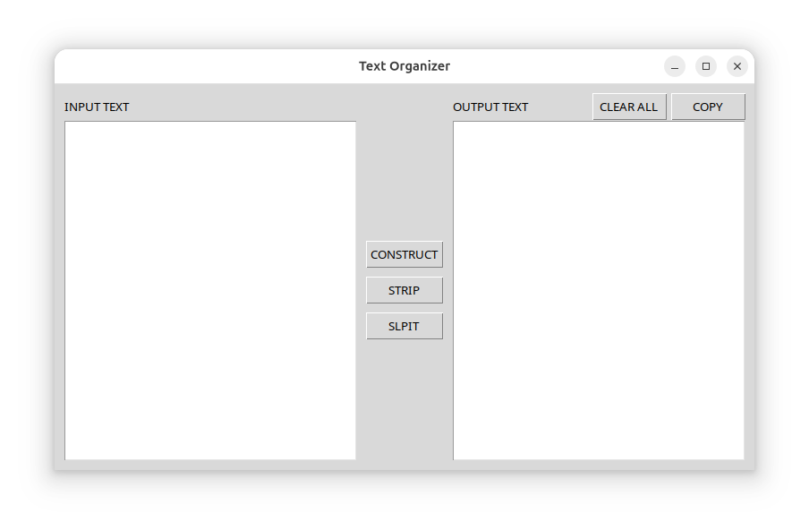

# Text Organizer

A lightweight Linux desktop utility for transforming text.

## Features
- Construct text from comma-separated input
- Strip leading/trailing whitespace per line
- Split text into one-item-per-line output
- Native Linux GUI
- No internet required
- Open source

## Application Screenshot 


## Download (Recommended)
Download the AppImage from the Releases page.

```bash
chmod +x Text_Organizer-x86_64.AppImage
./Text_Organizer-x86_64.AppImage
